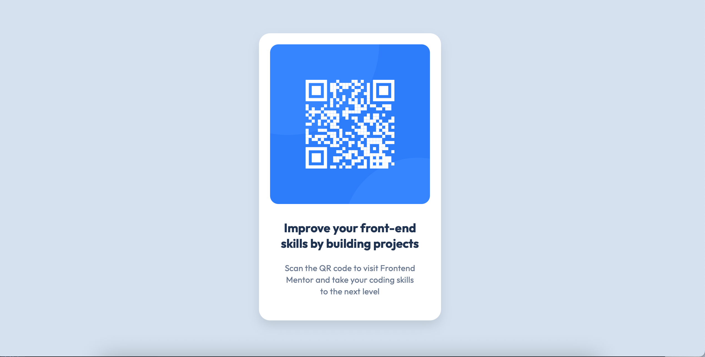
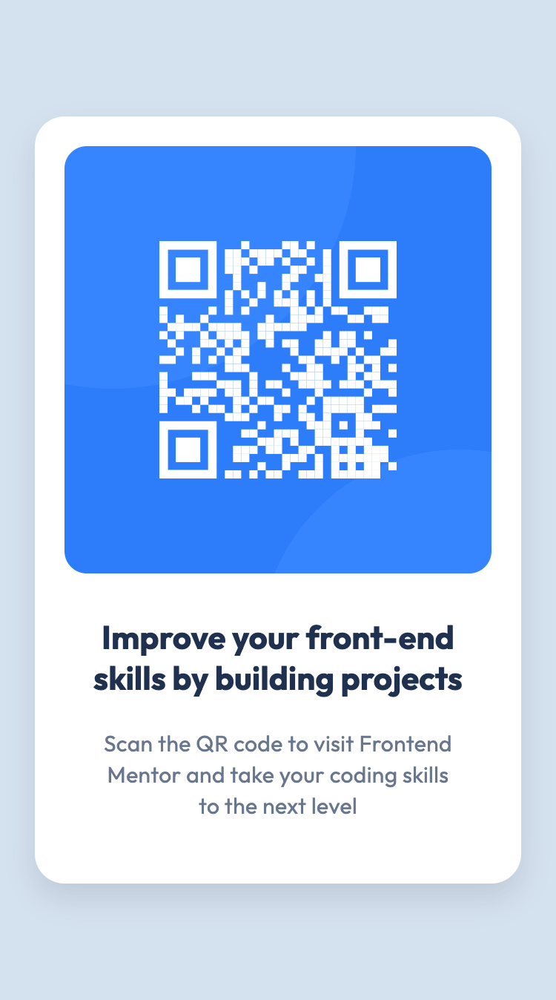

## Overview

### Screenshots

 

### Links

- Solution URL: [Add solution URL here](https://your-solution-url.com)
- Live Site URL: [Add live site URL here](https://your-live-site-url.com)

## My process

Alongside the challenge, I used Figma for the design details and VS Code to work through the html and css. Then used Github and Netlify to finish up.

### Built with

- Semantic HTML5 markup
- CSS custom properties

### What I learned

How to start looking at a brief such as these in the challenges and applying what I have learnt so far in my coding experience with what could be an actual project.

### Continued development

I want to continue learning how to read these sorts of projects and practice using the tools to bring them to completion so that I feel more comfortable with it all.

## Author

- Website - [Add your name here](https://www.your-site.com)
- Frontend Mentor - [@samp-111](https://www.frontendmentor.io/profile/samp-111)
